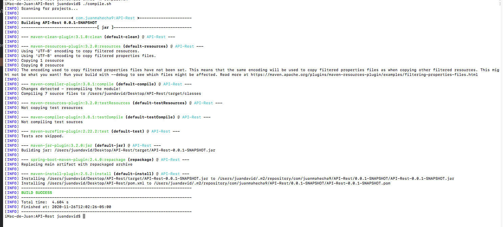
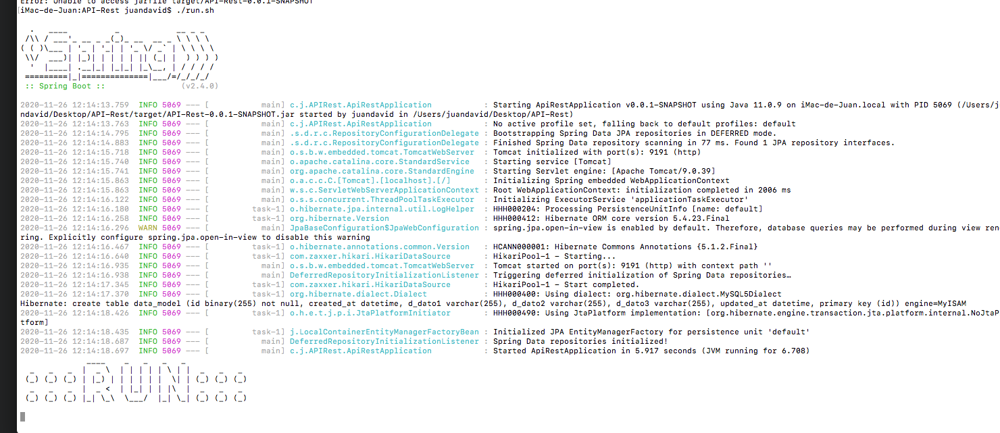

## Spring boot
Permite desarrollar y arrancar de forma muy rápida aplicaciones basadas en Spring.

## Desarrollo del proyecto
En primer lugar, creamos un proyecto maven. Para indicar que queremos utilizar Spring Web con Spring Boot; en el archivo pom.xml las dependencias del programa deben de ser:
~~~
    <dependencies>
	        <dependency>
    			<groupId>org.springframework.boot</groupId>
    			<artifactId>spring-boot-starter-data-jpa</artifactId>
    		</dependency>
    		<dependency>
    			<groupId>org.springframework.boot</groupId>
    			<artifactId>spring-boot-starter-web</artifactId>
    		</dependency>
    		<!-- https://mvnrepository.com/artifact/mysql/mysql-connector-java -->
    		<dependency>
    			<groupId>mysql</groupId>
    			<artifactId>mysql-connector-java</artifactId>
    			<version>8.0.22</version>
    		</dependency>
    
    		<dependency>
    			<groupId>com.h2database</groupId>
    			<artifactId>h2</artifactId>
    			<scope>runtime</scope>
    		</dependency>
    		<dependency>
    			<groupId>org.springframework.boot</groupId>
    			<artifactId>spring-boot-starter-test</artifactId>
    			<scope>test</scope>
    		</dependency>
    
    		<dependency>
    			<groupId>com.google.code.gson</groupId>
    			<artifactId>gson</artifactId>
    		</dependency>
	</dependencies>
~~~

# Creación de una API Rest generica

## Anotaciones de los archivos:
- @Autowired: A través de esta anotación Spring será capaz de llevar a cabo la inyección de dependencias sobre el atributo marcado. En este caso, estamos inyectando la capa de servicio, y por eso no tenemos que instanciarla.
- @RequestMapping: Con esta anotación especificamos la ruta desde la que escuchará el servicio, y qué método le corresponde.
- @ResponseBody: Con ella definimos lo que será el cuerpo de la respuesta del servicio.
- @PathVariable: Sirve para indicar con qué variable de la url se relaciona el parámetro sobre el que se esté usando la anotación
- La etiqueta @Configuration, indica que la clase en la que se encuentra contiene la configuración principal del proyecto.
- La anotación @EnableAutoConfiguration indica que se aplicará la configuración automática del starter que hemos utilizado. Solo debe añadirse en un sitio, y es muy frecuente situarla en la clase main
- La anotación @EnableAutoConfiguration indica que se aplicará la configuración automática del starter que hemos utilizado. Solo debe añadirse en un sitio, y es muy frecuente situarla en la clase main
   > Para no llenar nuestra clase de anotaciones, podemos sustituir las etiquetas @Configuration, @EnableAutoConfiguration y @ComponentScan por @SpringBootApplication, que engloba al resto. 
- Podemos también utilizar la etiqueta @RestController en lugar de @Controller, que sustituye al uso de @Controller + @ResponseBody,
- Los componentes de servicio son el archivo de clase que contiene la anotación @Service. Estos archivos de clase se utilizan para escribir lógica empresarial en una capa diferente, separada del archivo de clase @RestController.
    
    ## Funciones:
1. Crud de datos usando MySQL
   >
    #### Creación del proyecto 
    #### Creación del CRUD inicial
    1.1 Creación de los packages: Controller, Exception, Model, Repository y Service
    * Controller: Tendrá las rutas y método HTTP por los cuales se va a acceder a las peticiones determinadas
    * Exception: Mostrará mensajes al no encontrar una petición determinada
    * Model: Tendrá los archivos que contienen la estructura de datos de la DB junto con los metodos SET y GET para 
    modificar los mismos
    * Repository: Tendrá el archivo mediante el cual se tendrá acceso a los datos establecidos por el modelo de dats creado
    * Service:  El cual tiene los archivos que generan la lógica de las consultas HTTP
   >
    El proyecto se crea en la secuencia de:
     
    * Modelo → Java Class
    * Repositorio → Java Interface
    * ResourceNotFound → Java Class
    * DataModelService → Java Interface
    * Controller → Java Class
    * DataModelServiceImpl → Java Class 
    
  >Dentro del ResourceNotFound se encuentra la constante `private static final long serialVersionUID = 1L;`, la cual 
   significa: El serialVersionUID es un identificador de versión universal para una Serializableclase. 
   La deserialización usa este número para garantizar que una clase cargada corresponda exactamente a un objeto 
   serializado.
  >Dentro del archivo DataModelServiceImpl, implementa el DataModelService con lo cual se
    

# Ejecución del programa
Generar los permisos de ejecución para los archivos .sh
``chmod +x [nombre del archivo].sh``
Ejuctar los archivos en el orden:
* ./compile.sh
    
    Si al momento de ejecutar el script aparce Build Success, la compilación a sido un exito, de lo contrario revisar los mensajes que se muestran en consola.
* ./run.sh
                                                     
    Si al momento de ejecutar el script aparce :::RUN:::, la ejecución del programa ha sido un exito, de lo contrario revisar los mensajes que se muestran en consola.
                                                                                                                                              
* Ó también puedes usar el archivo `./default.sh`, el cual ejecutará  compile.sh y run.sh de la forma `./compile.sh && ./run.sh` que es otra forma de ejecutar los dos scripts a la vez.

# CREACIÓN DE LA AUTENTICACIÓN
* crear la carpeta de seguridad la cual contendrá la configuración de la autenticación
    - Crear roles, admin y user, en un archivo ENUM (Las enumeraciones o enum en un lenguaje de programación sirven para representar un grupo de constantes con un nombre.)
    - Crear el modelo de datos del usuario, definir como único el nombre de usuario 
